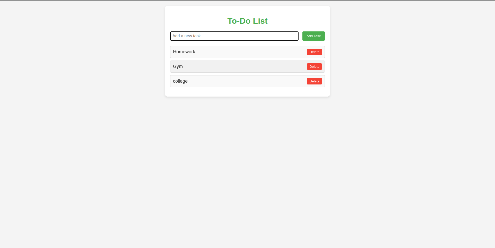

## Installation

1. Clone the repository:

    ```
    git clone https://github.com/rya23/todo.git
    ```

2. Navigate to the project directory:

    ```
    cd todo
    ```

3. Install dependencies:

    ```
    pip install -r requirements.txt
    ```

4. Run database migrations:

    ```
    python manage.py migrate
    ```

5. Start the development server:

    ```
    python manage.py runserver
    ```

6. Access the application at `http://localhost:8000` in your web browser.


